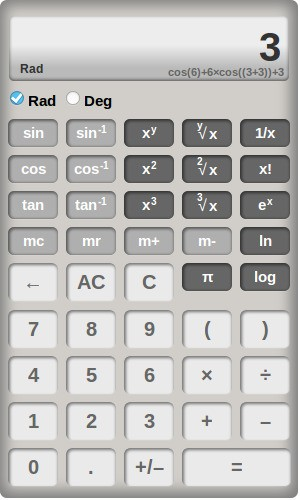

# Calculator - CalcSS3

A modified version of Peter Dematté's fine calculator. 
Features a different Layout and includes a representation of the current expression below the main display.
Apart from that the functionality has not been altered, so you can refer to the original documentation: [Using the Calculator](http://dematte.at/calculator#usage).

##Demo
See **demo** at [https://dipftba.github.io/calculator](https://dipftba.github.io/calculator/)

